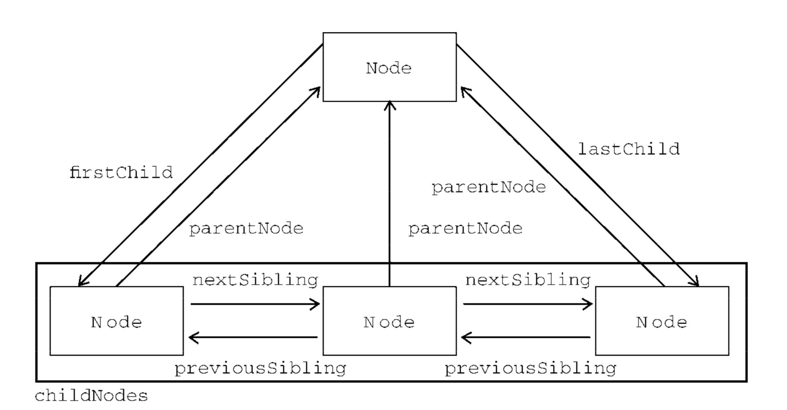

# javascript-node

javascript 高级编程笔记

- IEEE 754 标准表示的浮点数误差，例如 0.1 + 0.2 != 0.3 但是为什么 0.1 + 0.25 = 0.35 呢? 怎么解决浮点数计算的精度问题？
- NaN 表示一个本来要返回数值的操作数未返回数值的情况（这样不会抛出错误）， 怎么理解，为什么要不抛出错误呢？ 这样做的目的是什么？ 怎么理解本来要返回数值的操作数未返回数值的情况？
  isNaN 的执行步骤
  1 应用在普通值，尝试将值转换成数值，转换不成数值的返回 true，否则返回 false。 例如 isNaN(true) === false
  2 应用在对象上，先尝试调用对象的 valueOf，是否可以转换成数值。如果不可以，基于这个返回值，调用 toString，再判断该值是否可以转换成数值

* parseFloat 直解析 10 进制，因此没有第二个进制参数。

* 字符串中\x 和\u 的区别？为什么要有\x 和\u
  \x 表示以 16 进制的 nn 表示一个字符（其中 n 为 0-F)，例如 \x41 表示 A
  \u 表示以 16 进制代码 nnnn 表示一个字符（其中 n 为 0-F）,例如 \u03a3 表示希腊字符 Σ

* 如果字符中包含双字节，那么 str.length 返回的值就有可能不正确，为什么？ 怎么会不正确？
* 宿主对象 BOM 和 DOM,不在规范的定义范围之内，所以 BOM 和 DOM 可以不继承 Object
* 非两个数字的时候，+的操作对象，数值或者布尔值的时候，调用他们的 toString()方法取得字符值。其中 null 和 undefinde 会取’null’和’undefinde’
* 对于-操作符来说特殊点：
  1 对于有一个操作数是字符，布尔值，null 或者 undefined, 现在后台调用 Number()函数将其转换成数值，如果转换的值为 NaN，结果就为 NaN
  2 对于对象来说，先调用 valueOf 方法获取该对象表示的数值，如果得到的是 NaN，则结果就为 NaN.如果对象没有 valueOf 则调用对象的 toString 方 法，并将其转换成数字的形式。
* 字符比较的特殊情况， ‘a’ < 3 由于，在字符串和数字进行比较的时候，会将字符串值转换成数字，此时’a’转换的值是 NaN，NaN 与任何值想比较都是 false,所以此时是 false. 并且 ‘a’ >= 3 也为 false
* do while 属于后测试循环语句，里面的代码至少被执行一次。 While 属于前测试循环语句，里面的代码有可能一次也不执行。
* With 的使用场景，是用来简化多次编写一个对象的工作。
  例如
  ```javascript
  var hostName = location.hostname;
  var url = location.href;
  可以改写成;
  with (location) {
    var qs = search.substring(1);
    var hostName = hostname;
    var url = href;
  }
  ```
* Switch 语句需要注意的点：

1. 和其他语言不同，其他语言的 switch 语句只能传递数值,即 switch（数值）。但是 javascript 中可以传入任何值，字符串，数字，对象都可以
2. 并且 case 中跟的还可以是表达式。例如 case ‘hello’ + ‘world’
3. Swith 值与 case 中的表达式，相比较的时候，用的是===符号
4. 还有就是 switc 替代 for 循环的话，可以这么来写
   ```javascript
   var num = 25;
   switch (true) {
     case num < 0:
       alert('Less than 0.');
       break;
     case num >= 0 && num <= 10:
       alert('Between 0 and 10.');
       break;
     case num > 10 && num <= 20:
       alert('Between 10 and 20.');
       break;
     default:
       alert('More than 20.');
   }
   ```

- 函数的重载：可以为一个函数编写两个定义，只要这两个定义的签名（接受的参数类型和数量）不同即可。
- 函数签名指的是：参数类型，参数个数，参数顺序。
- 为什么说 catch 语句有自己的参数对象？
  当进入 catch 的执行环境的时候，会创建一个新的变量对象，表现在 catch(e)诸如了 e 参数，并且 catch 也不是一个函数。 此时 e 需要挂在到一个
  变量对象上，那么这个变量对象就是新创建的那个。而且 catch 语句是一个独立的作用域，就想函数那样。所以那才有自己的参数对象。
- 为什么使用 Array.apply(null, { length: 3 }) 来创建长度为 15 的数组？
  `Array.apply(null, { length: 3 }) 相当于 Array(undefined, undefined, undefined)`
- Array.prototype.sort 再没有指定回调函数的时候，比较的是字符串的大小。
  ```javascript
  values.sort();
  alert(values); //0,1,10,15,5
  ```
- 链接两个数组并且不用重新返回副本的方法
  原始方法。
  ```javascript
  var a = [];
  var b = [1, 2, 3];
  a = a.concat[b];
  ```
  这样需要创建一个副本，并且需要重新赋值
  简化的方法
  ```javascript
  Array.prototype.push.apply(a, b);
  ```
  这样不需要重新创建副本，并且不需要重新赋值的代码，简洁明了，vue 代码中很常见。
- 怎么理解数组的 slice 传入负数： 如果 slice 的参数传入的是一个负数，那么位置可以有数组的长度加上该负数来确定。例如
  ```javascript
  var a = [1, 2, 3, 4];
  var b = a.slice(1, -1);
  b = [2, 3];
  ```
- reduce 和 reduceRight 叫归并方法。怎么理解归并，reduceRight 很少见也很少用。
- 为什么 Date 对象支持的传递方式？  
   没有参数时：不解释，当前时间。  
   只有一个参数的时:  
   传入的是本地表示的时间，本地表示的时间格式可以通过 `var d = new Date() d.toLocaleString()`来获取
  例如 `var d = new Date(‘2019/2/08 14:00’)` 其实会调用 Date.parse，相当于 new Date(Date.parse(‘2019/2/08 14:00’))  
   当有两个以上参数时：  
   `Date ( year, month [ , date [ , hours [ , minutes [ , seconds [ , ms ] ] ] ] ] )`

      	Date的valueOf返回的是Date的毫秒表示，这也就是为什么可以直接比较两个时间的大小
      	`var d = new Date(2017, 2, 8). var d1 = new Date(2018,2,9).  d1 > d // true`

- 对于正则表达式中的静态属性的理解：
  RegExp 上挂载的静态属性有 input,lastMatch,lastParen,leftContent,rightContent。这些属性是根据上一次的正则结果挂载的。不明白为什么要挂在静态属性上???何用

  ```javascript
  var reg = /\s*((\w*)\s*="(\w*)")\s*/;
  const str = 'hello name="zhouxiaojie" world';
  const res = reg.exec(str);
  RegExp.input; // hello name="zhouxiaojie" world 输入的字符串
  RegExp.lastMath; // name="zhouxiaojie"  上次匹配的字符串，注意这里有匹配的空格
  RegExp.lastParen; // zhouxiaojie 最后匹配的分组
  RegExp.leftContent; // hello 匹配模式左边的内容
  RegExp.rightContent; // world 匹配模式右边的内容
  // 另外可以通过RegExp.$1....$9 获取分组内容
  ```

- 这里提到了不支持 unicode, `ES6应该提供了支持`要看一下是怎么支持的？
- 函数 caller 属性值，指向了调用它的函数，利用这个可以做一下报错堆栈
  ```javascript
  function a() {
    console.log('a caller', a.caller);
  }
  function b() {
    a();
  }
  b(); // function b();
  ```
  - 为什么不能为基本类型添加相应的属性值，例如
  ```javascript
  var str = 'hello world';
  str.name = 'zhou'; // 实际上访问 str.name的时候，javascript会创建一个包装对象，但是执行完这一行代码之后随即销毁
  console.log(str.name); // undefined 再次访问str.name的时候，又会新创建一个包装对象，此时的包装对象是没有.name这个属性的
  ```
- toFixed 返回的是数字的字符串表示，之前一直以为返回的是数字,并且它不光是指定后面的小数位，而且还有四舍五入的规则，例如
  ```javascript
  var a = '1.5';
  a.toFixed(0); // 2
  ```
- 为什么要使用 charAt 来获取某个位置的字符？用[index]的方式也可以访问
  在 IE7 中，使用[index]访问，会返回 undefined，ie 有兼容性问题，另外[index]访问超过字符长度的索引，返回的是 undefined. charAt 返回的是空字符串。
- subString, subStr, slice 的区别：  
  其中 subStr 未来将被移除，被 substring 替代。主要看 subString 和 slice 的区别:
  ```javascript
    var str = 'hello world';
    str.slice(3, -1) // lo world
    str.substring(3， -1) // hel subString会把-1转换成0,并且subString(3, -1) 相当于 subString(0, 3)
  ```
- 通过 indexOf 查找字符串中所有符合规则的子字符串
  ```javascript
  var str = 'hello world  i am teacher hello';
  var tem = 'ell';
  var posSet = [];
  var pos = str.indexOf(tem);
  while (pos > -1) {
    posSet.push(pos);
    pos = str.indexOf(tem, pos + 1);
  }
  posSet; // [1, 27]
  ```
- toLocaleLowerCase 和 toLocaleUpperCase 一般不知到程序要运行在那种语言环境的情况下最好是使用这两个方法
- 字符串的 math 本质上和正则表达是的 exec 方法是相同的。
  — 字符串的 search 方法，返回第一个匹配模式的位置，例如
  ```javascript
  var str = 'hello world';
  str.search(/\s/); // 5
  ```
- 对于 str.replace 中特殊字符的理解

```javascript
var str = '<div id="name" class="wrapper">hello world</div>';
const reg = /(\w*)="(\w*)"/g;
str.replace(
  reg,
  "匹配整个模式的字符串:$& 匹配字符串的左边内容:$' 匹配字符串的右边内容:$` $属性名:$1, 属性值:$2"
);
```

- 对于 str.replace 中第二参数传递函数的理解：  
   第二个参数是函数时，函数被注入的参数：
  1. 模式匹配项，模式匹配项在字符串中位置，原始字符串
  2. 当有分组的时候，参数依此是，匹配的字符串，第一个捕获的分组，第二个捕获的分组.....最后两个参数仍然是模式匹配在字符串中位置，原始字符串
  ```javascript
  var str = '<div id="name" class="wrapper">hello world</div>';
  const reg = /(\w*)="(\w*)"/g;
  str.replace(reg, (match, $1, $2, pos, source) => {
    // match id="name" class="wrapper"
    // $1 id class
    // $2 name wrapper
    // pos 模式匹配的字符在字符串中的位置
    // source 原始字符串
    console.log('match', match);
    console.log('$1', $1);
    console.log('$2', $2);
    console.log('pos', pos);
    console.log('source', source);
    return `属性名:${$1},属性值:${$2}`;
  });
  ```
- split 方法第一个参数不光可以指定字符，还可以指定正则表达式,第二个参数可以用来限定数组的长度。

```javascript
var colors = 'red,blue,green,yellow';
colors.split(',', 2); // ['red', 'blue']
colors.split(/[^,]+/); // ["", ",", ",", ",", ""] 怎么理解前面的""和后面的""
// 假设colors= ',red,blue,green,yellow,'
// colors.split(',') = ["", "red", "blue", "green", "yellow", ""]
```

- localeCompare 方法是比较字母在字母表中的顺序，并且有本地化

```javascript
'yellow'.localeCompare('black'); // -1
'balck'.localeCompare('yellow'); // 1
'yellow'.localeCompare('yellow'); // 0
```

- String.fromCharCode 接受一个或者多个字符编码，把他们转换成字符串

```javascript
String.fromCharCode(104, 101); // he
```

- 对于 encodeURI 和 encodeURIComponent 方法的理解：  
  ecodeURI 和 encodeURIComponent 可以对 Uri 进行编码，以便发送给浏览器，有效的 Uri 不能包含某些特殊字符，比如空格。而这两个方法是用来给 Uri 进行编码，他们使用特殊的 utf-8 来替换无效的
  字符，从而让浏览器能够接受和理解。
  其中 ecodeURI 主要是用于整个 url, ecodeURIcomponent 主要用于部分 url。ecodeURI 不会对属于 Url 特殊字符进行编码，如：/ + # & ?等，而 ecodeURIcomponent 会对所有的特殊字符进行编码例如

  ```javascript
  var uri = 'http://www.wrox.com/illegal value.htm#start';
  encodeURI(uri); //"http://www.wrox.com/illegal%20value.htm#start" 只对空格做了编码
  encodeURIComponent(uri); //"http%3A%2F%2Fwww.wrox.com%2Fillegal%20value.htm%23start" 对所有的特殊字符进行了编码
  ```

  对应相应的解码 `decodeURI` `decode- URIComponent`
  其中`escape`和`unescape`已经被废弃

- 在 eval 中创建的变量不会提升。
- 在 ECMAScript 中，没有指出如何访问 Global 对象，但是浏览器都是把它作为 window 一部分来实现的。所以浏览器下的 Global 是 window 对象的一个子集。因为 window 不仅包含规范内定义的内容，来 还包含了宿主浏览器的一些内容。
- 舍入方法。  
  `Math.floor` 向下取证 `Math.ceil` 向上取整 `Math.round`标准的四舍五入
- 对于 Math.random 的理解:  
  Math.random 产生的一个`大于等于0` `小于1` 的数，所以要想产生一个闭范围的值。例如
  ```javascript
  function getRandomRange(min, max) {
    return Math.floor(Math.random() * (max - min + 1)) + min; // 注意这里max - min + 1 开范围的不加1即可
  }
  ```
- 在使用 Object.defineProperty 定义属性描述的时候，configurable, configurable, wirteable 默认为 false
- 在没有 Object.defineProperty 可以设置 setter getter 方法之前，浏览器使用了两个非标准方法**defineGetter**和**defineSetter**这也就是为什么在 chrome 终端打印对象的时候，会 有这两个方法。使用旧访问器代码如下：

  ```javascript
  var o = {
    name: 'hello'
  };
  o.__defineGetter__('hello', () => {
    return this.name + 'getter';
  });
  o.__defineSetter__('hello', value => {
    this.name = value;
  });
  ```

- `Object.getOwnPropertyDescriptor()`只能获取实例属性的描述
- `Object.getOwnPropertyNames` 获取所有的属性名称，包括不可枚举的
- instanceOf 操作符的理解，只要是实例的原型链上包含 f.prototype,那么 instance instanceOf f 就会返回 true.
- 全局变量会作为 windos 上的一个属性存在，但是没法用 delete 删除。但是直接定义在 window 上的属性可以使用 delete 删除。实际上通过 var 声明的全局变量`[[Configurable]]`设置成 了`false`，所以是不可以删除的
- setInterval 会出现，原因是后一个间歇调用可能会在前一个间歇调用结束之前启动。（这句话不太理解）
- loacation 有一个有意思的地方, location 即是 window 的属性也是 document 的属性，通过`window.location`和`document.location`都能访问得到。
- location 对象下的几个属性: `hash`返回#后面的字符,例如`http://www.baidu.com#hash#abc`返回的是`#hash#abc` `host`返回服务器名称和端口号，返回`www.baidu.com`, `hostname` 返回不带端口号的主机名称`www.baidu.com`, `href`返回完整的 url 信息，location 对象的 toString 方法也会返回同样的值. `pathname`返回 url 的路径名称。 `protocol`返回的是使用的协议`http`或者`https`。 `search`返回的是 url 查询字符串,例如`?name=zhou`
- 可以通过`location.assign('http://www.baidu.com')`打开一个新的网址，并向历史记录中添加一条记录。和`window.location='www.baidu.com'`,`location.href='www.baidu.com'`
- 也可以通过修改`location`对象的其他属性来修改 url, `location.hash`修改 url 的 hasn 值。`location.search`给网址添加查询字符串。`location.hostname`修改主机名。 `location.pathname` 修改文件路径 `location.port` 修改 url 的端口。
- `location.reload`用来重新加载页面，如果没有传任何参数，那么页面将以最有效的方式加载，如果页面自上次请求就没有改变过，那么就是从缓存中加载页面。如果需要强制从服务器下载页面，需要执行`location.reload(true)`
- 对于 location 上的方法在 chrome 上进行测试，只有一下属性是存在的。树上写的很多都已经废弃了。

```javascript
with (navigator) {
  console.log('appCodeName', appCodeName);
  console.log('appName', appName);
  console.log('appVersion', appVersion);
  console.log('cookieEnabled', cookieEnabled);
  console.log('language', language);
  console.log('mimeTypes', mimeTypes);
  console.log('onLine', onLine);
  console.log('platform', platform);
  console.log('plugins', plugins);
  console.log('productSub', productSub);
  console.log('userAgent', userAgent);
  console.log('vendor', vendor);
  console.log('vendorSub', vendorSub);
}
```

- 对于 navigator 对象来说,有一个方法比较特殊`sendBeacon`方法，可以在页面卸载的时候发送异步请求到服务端。之前的做法是使用 beforeUpload，但是浏览器会在页面卸载的时候，丢弃异步请求，通常会发送同步请求，那么此时就会阻碍页面的关闭，造成不好的体验.
- IE 中变态的兼容性问题，今天算是了解了。例如

```javascript
// 大多数浏览器检测到document.createElement的时候都会返回true，但是ie不会,例如
typeof document.createElement == 'function'; // false ie8以前，ie9修复了这个问题 typeof docuement.createElement返回的object,在ie中，是通过com实现dom操作而不是通过dom，所以typeof返回的是对象，不是函数
```

在 ie 中，把方法当作属性访问也可能有问题，例如

```javascript
var xhr = new ActiveXObject('Microsoft.XMLHttp');
if (xhr.open) {
  // 这样的操作在ie下会报错
}
// 这个时候可以使用typeof来检查，但是ie下,typeof xhr.open返回的是unknown
typeof xhr.open; // unknown
```

所以才有特别变态的检测某个属性是否存在的方法,奇葩,现在应该不会有这样的代码了，不过老代码应该还是有的。

```javascript
  funciton isHostMethod (object, prop) {
    var t = typeof object[prop];
    return t === 'function' ||
           (!!(t === 'object' && object[prop])) || // ie下有可能返回object,并且此时object[prop]不应该为null
           t === 'unknown' // ie下
  }
```

- 用户代理检测，opera 可以使用 window.opera 对象来检测是否欧朋浏览器，但是在最新版的浏览器中，是无法获取这个属性值的。有待考证。
- 检测是不是 webkit 浏览器引擎

```javascript
var reg = /AppleWebKit\/(\S+)/;
var match = window.navigator.userAgent.match(reg);
var version = match[1];
if (match) {
}
```

- 检测 KHTML 引擎

```javascript
var reg = /KHTML\/(\S+)/;
var reg = /Konqueror\/([^;]+)/;
```

- 检测 Gecko,火狐的浏览器引擎

```javascript
var reg = /rv:([^\)]+)\) Gecko\/\d{8}/;
```

- 检测 ie

```javascript
var reg = /MSIE ([^;]+)/;
```

- 识别浏览器，光靠识别渲染引擎，是无法识别浏览器的，比如 Safari 和谷歌的 chrome 浏览器都是使用的 webkit 渲染引擎，只是 javascript 的执行引擎不一样。
- 几个浏览器的渲染引擎

1. ie Trident [ˈtraɪdnt]
2. chrome webkit
3. Safari webkit
4. Opera Presto ['prɛsto]
5. NetScape Gecko ['gɛko]
6. Firefox Gecko

- DOM1 中规定的了 12 中 node 类型

1. `Node.ELEMENT_NODE(1)`
2. `Node.ATTRIBUTE_NODE(2)`
3. `Node.TEXT_NODE(3)`
4. `Node.CDATA_SECTION_NODE(4)`
5. `Node.ENTITY_REFERENCE_NODE(5)`
6. `Node.ENTITY_NODE(6)`
7. `Node.PROCESSING_INSTRUCTION_NODE(7)`
8. `Node.COMMENT_NODE(8)`
9. `Node.DOCUMENT_NODE(9)`
10. `Node.DOCUMENT_TYPE_NODE(10)`
11. `Node.DOCUMENT_FRAGMENT_NODE(11)`
12. `Node.NOTATION_NODE(12)`
    在比较节点类型需要注意的点：

```javascript
if (somenode.nodeType === Node.ELEMENT_NODE) {
  // 在ie中是无效的,因为ie没有把Node构造函数给暴露出来
}
// 所以兼容比较好的方式
if (somenode.nodeType === 1) {
}
```

`需要注意的一点，并不是所有的节点类型都受浏览器支持`

- 可以通过 nodeName 和 nodeValue，获取节点名称和节点值
- 可以通过 childNodes,返回一个类数组子节点`NodeList`，比较特别的是，这个`NodeList`是动态的，能够根据 dom 动态变化，并不是快照。
- childNodes 可以通过`NodeList[0]`或者`NodeList.item(0)`来获取其中的节点
- childNodes 的兼容性问题:

```javascript
// 要想把childNodes转换成数组,可以通过下面的方式
Array.prototype.slice.call(NodeList); // 当然现在最简单并且最语意化的方式是：Array.form(NodeList)
// 但这种写法在ie8之前是有问题的，ie8之前的dom是根据com实现的，直接使用js对象的写法会报错。兼容性写法如下:
function convertToArray(nodes) {
  let array;
  try {
    array = Array.prototype.slice.call(nodes);
  } catch (e) {
    for (let i = 0, len = array.length; i < len; i++) {
      array.push(nodes[i]);
    }
  }
  return array;
}
```

- 可以通过`parentNode`来访问父节点。通过`previousSibling`和`nextSibling`访问兄弟节点,可以通过`firstChild`和 `lastChild`来访问第一个和最后一个节点。

- `hasChildNodes`这个方法在包含一个或者多个子节点的时候返回 true。
- 节点的`ownerDocument`指向表示整个文档的文档节点, 即`document对象`。
- `appenChild`用来添加子节点。`insertBefore` 在参考节点之前添加节点。需要注意的一点，如果 insertBefore 方法中，参考元素为 null，那么就和 appendChild 是一样的。

```javascript
var node = parent.insertBefor(newNode, null); // 作用和appendChild是一样的
var node = parent.insertBeofre(newNode, parent.firstChildNode); //
```

- `replaceChild`接受的两个参数是，要插入的节点和要被替换的节点。
- `removeChild` 移除节点
- `cloneNode`克隆节点,参数是一个布尔值，表示要不要深克隆。对于这个方法的理解，例如

```html
<ul id="ul">
  <li>1</li>
  <li>2</li>
  <li>3</li>
</ul>
```

```javascript
var ulDom = window.ul;
var copyDom = ulDom.cloneNode(); // 此时执行的是浅克隆，所以只克隆了ul元素，它下面的li元素是没有被克隆的。
var copyDom = ulDom.cloneNode(true); // 此时执行的深克隆，所以会把他下面的子元素li一块克隆
```

`需要注意的是:克隆只会克隆元素和元素的特性，并不会克隆和javascirpt相关的属性，例如事件处理程序`

- `normalize`方法，序列化删除多余的文本节点, [例子](http://www.w3school.com.cn/tiy/t.asp?f=jsref_node_normalize)
- 可以通过`document.documentElement`来访问 html 元素。也可以通过`document.firstChild`和`document.childNodes[0]`
- 可以通过`document.doctype` 对<!DOCTYPE>的引用
- 可以通过`document.title`来获取页面展示的 title 或者修改 title
- 特殊的几个属性`url`, `domain`和`referrer`所有这些信息都存在于请求的 HTTP 头部,通过 javascript 我们可以访问他们。并且这几个的值，只有`document.domain`是可以设置的。并且 document.domain 的设置也是有限制的，不能将属性值设置成 url 中不包含的域,例如

```javascript
//假设页面来自 p2p.wrox.com 域
document.domain = 'wrox.com'; // 成功
document.domain = 'nczonline.net'; // 出错!
```

浏览器对 domain 属性还有一个限制，即如果域名一开始是“松散的”(loose)，那么不能将它再设 置为“紧绷的”(tight)。换句话说，在将 document.domain 设置为"wrox.com"之后，就不能再将其 设置回"p2p.wrox.com"，否则将会导致错误，如下面的例子所示。

```javascript
//假设页面来自于 p2p.wrox.com 域
document.domain = 'wrox.com'; //松散的(成功)
document.domain = 'p2p.wrox.com'; //紧绷的(出错!)
```

- 查找元素`document.getElementById`和`document.getElementsByTagName`,不过现在使用`querySelector`和`querySelectorAll`比较多
